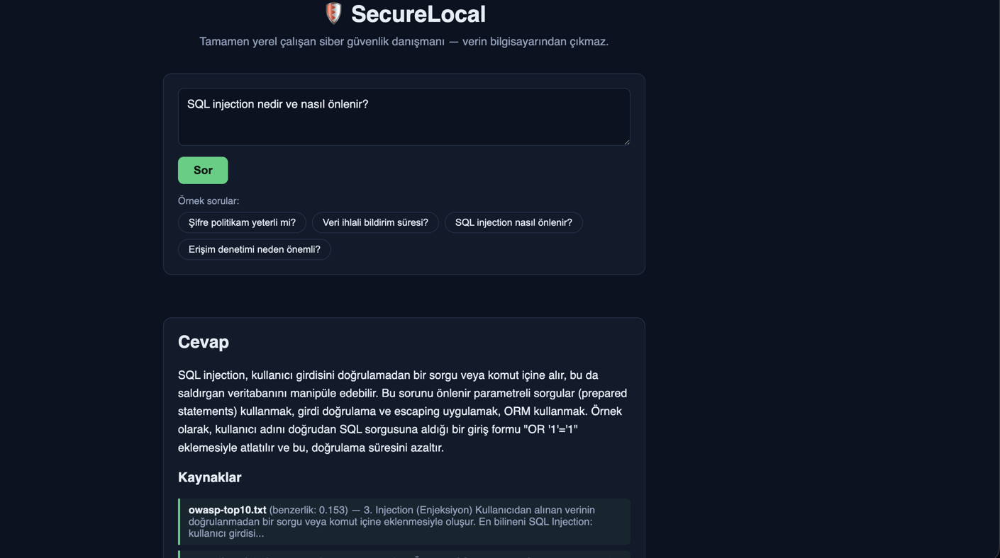

# SecureLocal 🛡

**Tamamen yerel çalışan, kaynak göstererek cevap veren bir siber güvenlik ve KVKK danışmanı.**

Microsoft Yaz Programı 2026 — Azure Foundry Local (Local RAG) projesi. Hazırlayan: [Deniz](https://github.com/Deniz3448), 1. sınıf Bilgisayar Mühendisliği öğrencisi.



---

## Bu proje ne yapıyor?

SecureLocal'a bir siber güvenlik veya KVKK sorusu soruyorsun ("Şifre politikam yeterli mi?",
"SQL injection nasıl önlenir?" gibi). Uygulama, cevabı kafasından uydurmuyor: önce kendi
belgelerinden (OWASP Top 10, KVKK özeti, örnek bir şirket parola politikası, örnek güvenlik açığı
senaryoları) en alakalı parçaları buluyor, sonra bu parçaları kaynak göstererek, **tamamen kendi
bilgisayarında çalışan** bir yapay zeka modeliyle cevaba dönüştürüyor.

## Neden yerel?

Bir şirketin parola politikasını ya da bir güvenlik açığını ChatGPT'ye sormak, o veriyi buluta
göndermek demek. SecureLocal, [Azure Foundry Local](https://learn.microsoft.com/azure/ai-foundry/foundry-local/)
kullanarak modeli tamamen bilgisayarda çalıştırıyor — hiçbir soru, hiçbir belge internete
gitmiyor. İnternet bağlantısını tamamen kapatıp da çalıştırabilirsin; bu, hassas güvenlik verisiyle
uğraşan bir araç için tam da işverenlerin aradığı özellik: "veri bilgisayardan çıkmıyor."

## Nasıl çalışıyor? (RAG akışı)

```
Sen soru sorarsın
   ↓
Soru, kaynak belgelerdeki paragraflarla TF-IDF + kosinüs benzerliği ile karşılaştırılır
   ↓
En alakalı 4 parça bulunur                              ←── Retrieval (Getirme)
   ↓
Bu parçalar + soru, Foundry Local'daki modele gönderilir
   ↓
Model sadece bu kaynaklara dayanarak cevap yazar         ←── Generation (Üretim)
   ↓
Cevap + hangi belgeden geldiği ekrana döner
```

Gömme (embedding) adımı için harici bir model indirmek yerine, klasik bir bilgi getirimi yöntemi
olan **TF-IDF + kosinüs benzerliği** kullanılıyor — hiçbir ek bağımlılık gerektirmiyor, kurulumu
saniyeler sürüyor ve mantığını uçtan uca okuyup anlamak kolay.

Küçük bir eş anlamlı kelime sözlüğü de var (`ESANLAMLILAR` içinde, örn. "şifre" ↔ "parola"):
TF-IDF tam kelime eşleşmesi arıyor, kullanıcı "şifre" diye sorup belge "parola" diyorsa hiç sonuç
bulamıyordu. Bu basit eşleme, gerçek bir embedding modelinin kendiliğinden çözdüğü "anlamca yakın
kelimeleri tanıma" problemine ucuz bir çözüm.

## Proje yapısı

```
SecureLocal/
├── data/                        kaynak belgeler (.txt) — buraya kendi belgeni de atabilirsin
│   ├── owasp-top10.txt
│   ├── kvkk-ozet.txt
│   ├── sifre-politikasi.txt
│   └── guvenlik-aciklari-ornek.txt
├── public/                      arayüz (saf HTML/CSS/JS, framework yok)
│   ├── index.html
│   ├── style.css
│   └── app.js
├── server.js                    backend: chunking, TF-IDF arama, Foundry Local entegrasyonu
├── package.json
└── .env.example                 Foundry Local bağlantı ayarları şablonu
```

## Kurulum

```bash
# 1) Homebrew yoksa önce onu kur (macOS paket yöneticisi)
/bin/bash -c "$(curl -fsSL https://raw.githubusercontent.com/Homebrew/install/HEAD/install.sh)"

# 2) Foundry Local CLI'yi kur
brew tap microsoft/foundrylocal
brew install foundrylocal

# 3) Servisi sabit bir portta başlat (her seferinde aynı port kalsın diye)
foundry service set --port 5273
foundry service start

# 4) Modeli indir ve bir kere çalıştırarak yükle (CPU'ya uygun sürüm)
foundry model run Phi-3.5-mini-instruct-generic-cpu:2

# 5) Proje bağımlılıklarını kur
npm install

# 6) .env dosyasını oluştur (varsayılan .env.example zaten yukarıdaki ayarlarla eşleşiyor)
cp .env.example .env

# 7) Sunucuyu başlat
npm start
```

Tarayıcıda `http://localhost:3000` adresini aç.

> Foundry Local henüz kurulu değilse veya çalışmıyorsa uygulama çökmez: en alakalı kaynak
> parçalarını doğrudan gösteren bir yedek moda düşer, böylece arayüzü yine de test edebilirsin.

> **Hız notu:** Bu, bulut değil senin bilgisayarında çalışan küçük bir model — ekran kartı yoksa
> (CPU'da) bir cevap üretmesi 30 saniye ile 1.5 dakika arasında sürebilir. Bu normal; "yerel ve
> gizli çalışmanın" bedeli budur.

## Örnek sorular

- "Şifre politikam yeterli mi?"
- "KVKK'ya göre veri ihlalini kaç saatte bildirmeliyim?"
- "SQL injection nedir ve nasıl önlenir?"
- "OWASP Top 10'da erişim denetimi neden önemli?"

## Kullanılan teknolojiler

- **Node.js + Express** — sunucu
- **Azure Foundry Local** (`phi-3.5-mini`) — yerel LLM çalıştırma, OpenAI-uyumlu API
- **TF-IDF + kosinüs benzerliği** — yerel arama/retrieval, harici embedding modeli gerektirmez
- Sade **HTML/CSS/JS** arayüz — framework yok

## Bilinen sınırlamalar

- TF-IDF, gerçek embedding modelleri gibi "anlamı" değil, sadece kelime örtüşmesini anlıyor.
  Eş anlamlı kelime sözlüğü bunu kısmen telafi ediyor ama tam bir çözüm değil.
- `phi-3.5-mini` küçük ve yerel bir model olduğu için bulut modellerine göre hem daha yavaş hem
  bazen daha dağınık cevaplar verebiliyor — bu, gizlilik karşılığında kabul edilen bir ödünleşim.

## Ne öğrendim

- RAG'in retrieval (kaynak bulma) ve generation (cevap üretme) adımlarının birbirinden ayrı,
  test edilebilir parçalar olduğunu — retrieval'ı LLM'siz de test edip doğrulayabildim.
- TF-IDF gibi basit bir yöntemin bile işe yaradığını, ama "şifre" sorup belgede "parola" yazınca
  hiç sonuç bulamadığını görünce eş anlamlı kelime probleminin ne kadar gerçek olduğunu anladım.
- Küçük, yerel bir modelin (phi-3.5-mini, ~2.5GB) CPU'da çalışabildiğini ama bulut modellerine göre
  hem daha yavaş hem bazen daha "dağınık" cevaplar verdiğini — bu, gizlilik/hız arasındaki gerçek
  bir mühendislik ödünleşimi.
- Foundry Local'ın OpenAI-uyumlu bir API sunduğunu, yani `/v1/chat/completions` gibi standart bir
  formatla konuştuğunu — ileride başka bir yerel/bulut modele geçmek istersem kod neredeyse
  değişmeden kalır.

## Lisans

MIT — `data/` klasöründeki belgeler eğitim amaçlı, sadeleştirilmiş özetlerdir; resmi kanun/standart
metinlerinin yerine geçmez.
